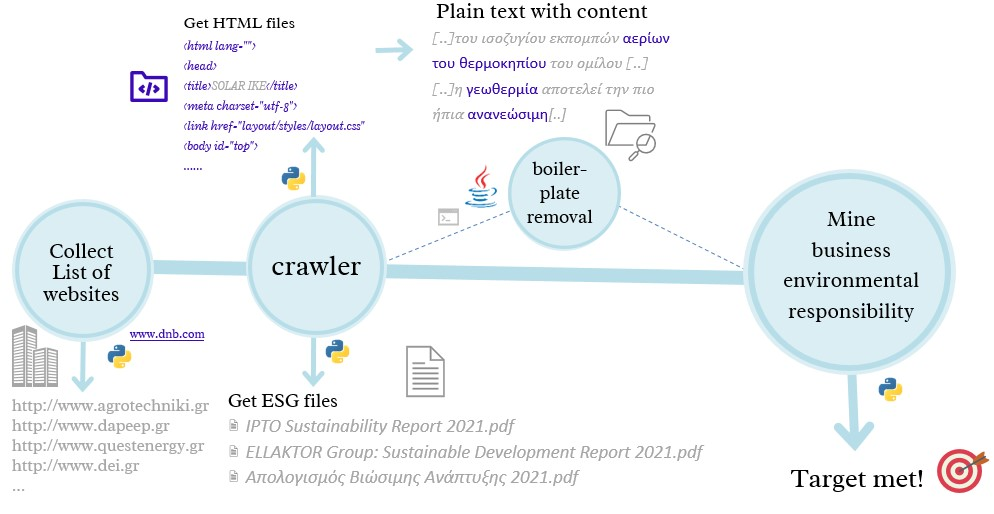

# websites_extraction
In this repository there are files are part of the Thesis:  
[Automating the data acquisition of Businesses and their actions regarding environmental sustainability: The Energy Industry in Greece](Thesis_DI_Format%20(1).pdf)

Parts of the data engineering process that is described in the thesis file, written in Python, that all together consist the pipeline of the procedure shown in the image below:

The steps are the following:
1. Use a crawler algorithm to exract a **list** of all the Greek businesses that belong to the energy factor with their domains (source www.dnb.com)
2. Use a crawler algorithm that will look over all the HTML of each and every domain in our **list** as well as all the URLs appearing on these web pages and its subdomains & will extract their content (HTML files). Moreover it will extract pdf files refering to ESG factors (script related &rightarrow; crawler_pdfs.py)
3. A boiler plate removal algorithm that removes HTML syntax and keep only the text (not publicly available in the repository)
4. Evaluate web-scrapping process defining & calculating specific metrics. Exports the results in a csv (script related &rightarrow; meta_cleaning_2.py)

0. There is also available a script of the crawler designed to read local HTML files (instead of URLs as decribed in step 2), in order to extract ESG pdf files.

## How to run

